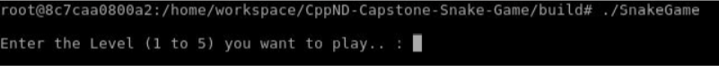
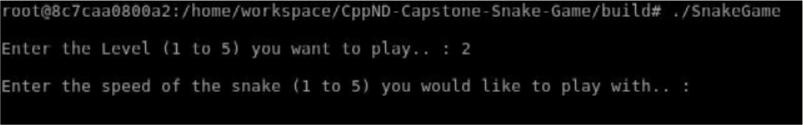

# Udacity C++ Nanodegree

# Snake Game Project

This is the Capstone project in the [Udacity C++ Nanodegree Program](https://www.udacity.com/course/c-plus-plus-nanodegree--nd213). The code for this repo was inspired by [this](https://codereview.stackexchange.com/questions/212296/snake-game-in-c-with-sdl) excellent StackOverflow post and set of responses.

# Class Structure of the project code

## `main.cpp`
* `main.cpp` is the entry point of the game. The main function defines the screen and grid height and width, the frames per seconds at which the game is played. Apart from this,   the main function creates the `Userio`, `Mazes`, `Snake`, `Game`, `Renderer` and the `Controller` objects. The main also calls the `Game:Run():` method to start the game loop.

## `userio.h` and `userio.cpp`
* The `Userio` class basically takes inputs from the user and has two functions, `Userio::TakeUserLevel()`and `Userio::TakeUserSpeed()`, which accept, process and return the level at which the user wants to play and the snake speed respectively as the input.

 
 

## `mazes.h` and `mazes.cpp`
* The `Mazes` class is responsible to create the a square maze along the borders of the game window, depending upon the level the user is playing at. The Maze class stores,
  * The dimentions of the maze walls
  * user level
  * funcion `Mazes::CreateMaze()` that creates the maze
  * Functions that return the boundaries of all the maze parts, `Mazes::GetMazeTopEdge()`, `Mazes::GetMazeBottomEdge()`, `Mazes::GetMazeLeftEdge()` and                               `Mazes::GetMazeRightEdge()`
* The Maze class defines the dimensions of the Maze. The basic idea behind introducing the maze is to increase the difficulty of the game depending upon the level and reducing     the area of playground the snake can cover. 
* If the snake head touches the any maze wall, it dies. The following images show how the 5 levels look.

     

## `snake.h` and `snake.cpp`
* The `Snake` class contains attributes to keep track of the `Snake` speed, size, and location. Additionally, there are methods to update the snake state, which are called from the `Game::Update` method. The Snake head and body are treated separately; the head is stored using float coordinates, and the body is stored using a vector of int cell coordinates. The `Snake::UpdateHead` method updates the head location using the snake's speed. If the head has passed into a new cell, then the body is updated with the `Snake::UpdateBody`.
* One additional function is added, `Snake::UpdateSpeed()`, which updates the speed according to user speed input.

## `game.h` and `game.cpp`
* The `Game` class defines the game loop which is inside the function `Game::Run()`. It stores the state of the game, including an instance of a Snake object, Mazes object, the   game score, and the location of "food" in the game. Aside from the game loop, the Game class also contains methods to update the state of the game `Game::Update()`, get the     size of the snake, get the total score in the game, and place new food in the game if the food has been eaten by the snake.
* Two additional functions have been added,
  * `Game::GetLives()` : The game gives the user 3 lives for the snake, i.e. if the snake dies, the game restarts with just the snake head. This would happen 3 times, and after     the 3rd time, the game is over. The lives are updated accordingly in the `Game::Update()` function. `Game::GetLives()` function returns the available snake lives. 
  * `Game::SnakeTouchesMaze()`: This fucntion checks if the snake head touches any of the head walls. If it does, the snake dies and the game restarts with just the snake head       if there are lives available.
* One additional feature has been added for the `Game::PlaceFood()` method to function correctly. In the `main()` function, the all maze boundaries are stored in four int         variables and sent to the `Game` class object. The random number generator uses these variables as the upper and lower limits to generate random places for the food. With       this, it is made sure that the food is placed inside the maze area.
  
## `renderer.h` and `renderer.cpp` 
* These files define the Renderer class which uses the [SDL library](https://www.libsdl.org/) to render the game to the screen. The `Renderer::Render()` method draws the food, the snake and the maze in the window using the SDL renderer.

## `controller.h` and `controller.cpp`
* These files define the Controller class. This class handles keyboard input using the SDL libary, and it sets the snake's direction based on the input.

# Dependencies for Running Locally
* cmake >= 3.7
  * All OSes: [click here for installation instructions](https://cmake.org/install/)
* make >= 4.1 (Linux, Mac), 3.81 (Windows)
  * Linux: make is installed by default on most Linux distros
  * Mac: [install Xcode command line tools to get make](https://developer.apple.com/xcode/features/)
  * Windows: [Click here for installation instructions](http://gnuwin32.sourceforge.net/packages/make.htm)
* SDL2 >= 2.0
  * All installation instructions can be found [here](https://wiki.libsdl.org/Installation)
  * Note that for Linux, an `apt` or `apt-get` installation is preferred to building from source.
* gcc/g++ >= 5.4
  * Linux: gcc / g++ is installed by default on most Linux distros
  * Mac: same deal as make - [install Xcode command line tools](https://developer.apple.com/xcode/features/)
  * Windows: recommend using [MinGW](http://www.mingw.org/)

# Basic Build Instructions

1. Clone this repo.
2. Make a build directory in the top level directory: `mkdir build && cd build`
3. Compile: `cmake .. && make`
4. Run it: `./SnakeGame`.
